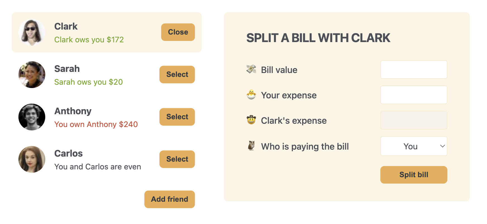

# Eat-N-Split

A React app for splitting bills between friends. Add friends, select one, and split expenses — tracking who owes whom.

## Screenshot

## Tech

- React 19 (Create React App)
- State managed with `useState` hooks
- CSS Grid layout

## Scripts

- `npm start` — dev server
- `npm run build` — production build
- `npm test` — run tests

## Credits

Design provided by [Jonas Schmedtmann](https://www.udemy.com/user/jonasschmedtmann/)'s Ultimate React Course on Udemy.
